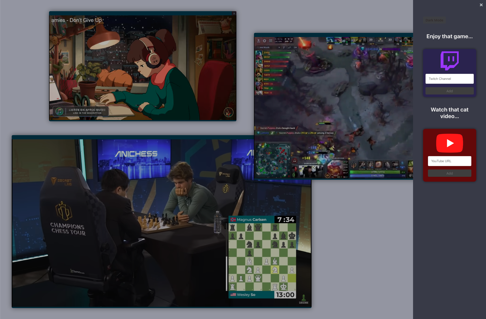

# Multi-Stream-Dashboard

## Overview
This is a React application that allows users to create and manage windows displaying Twitch and YouTube content. Users can add Twitch channels and YouTube videos to the layout, resize and drag the windows, and switch between dark and light modes.



## Technologies Used
- React
- react-burger-menu (for the sidebar menu)
- iframe

## Installation
1. Clone the repository to your local machine.
   ```bash
   git clone git@github.com:eriksalsborn/Multi-Stream-Dashboard.git

2. Navigate to the repository
```bash
cd multi-stream
```
3. Install dependencies.
```bash
npm install
```
4. Start the development server.
```bash
npm start
```
*Voila! Open your browser and visit http://localhost:3000 to view the app*

## Features

### Adding Twitch Streams
- Enter the Twitch channel name in the Twitch Channel input field.
- Click the "Add" button to create a new window displaying the Twitch channel's stream.
- The window can be resized and dragged.
- 
### Adding Youtube Videos
- Enter the Twitch channel name in the Twitch Channel input field.
- Click the "Add" button to create a new window displaying the Twitch channel's stream.
- The window can be resized and dragged.

### Dark Mode
- Toggle between Dark and Light modes using the "Dark Mode" button in the sidebar menu.

### Window Management
- Close a window by clicking the close button on the window.
- Resize a window by dragging the edges.
- Drag a window by clicking and dragging the title bar.
